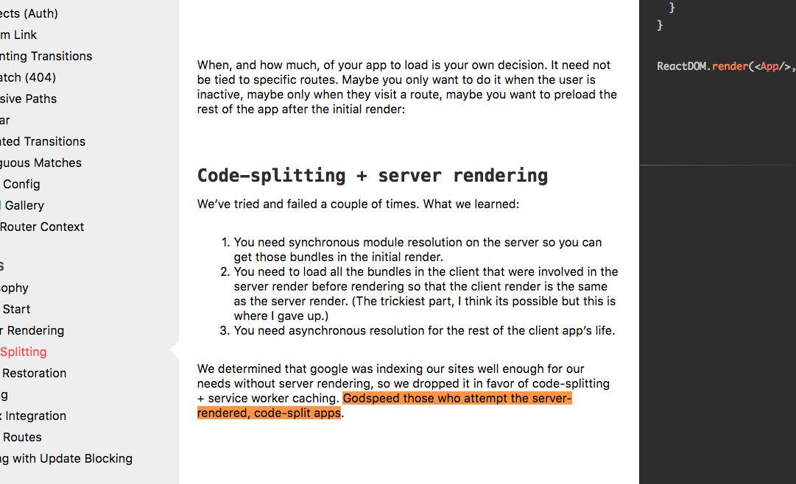
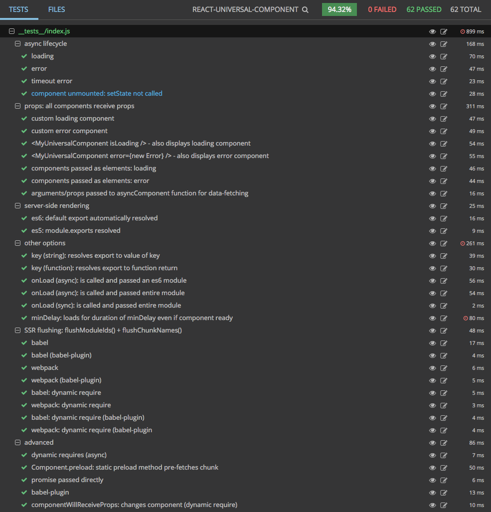
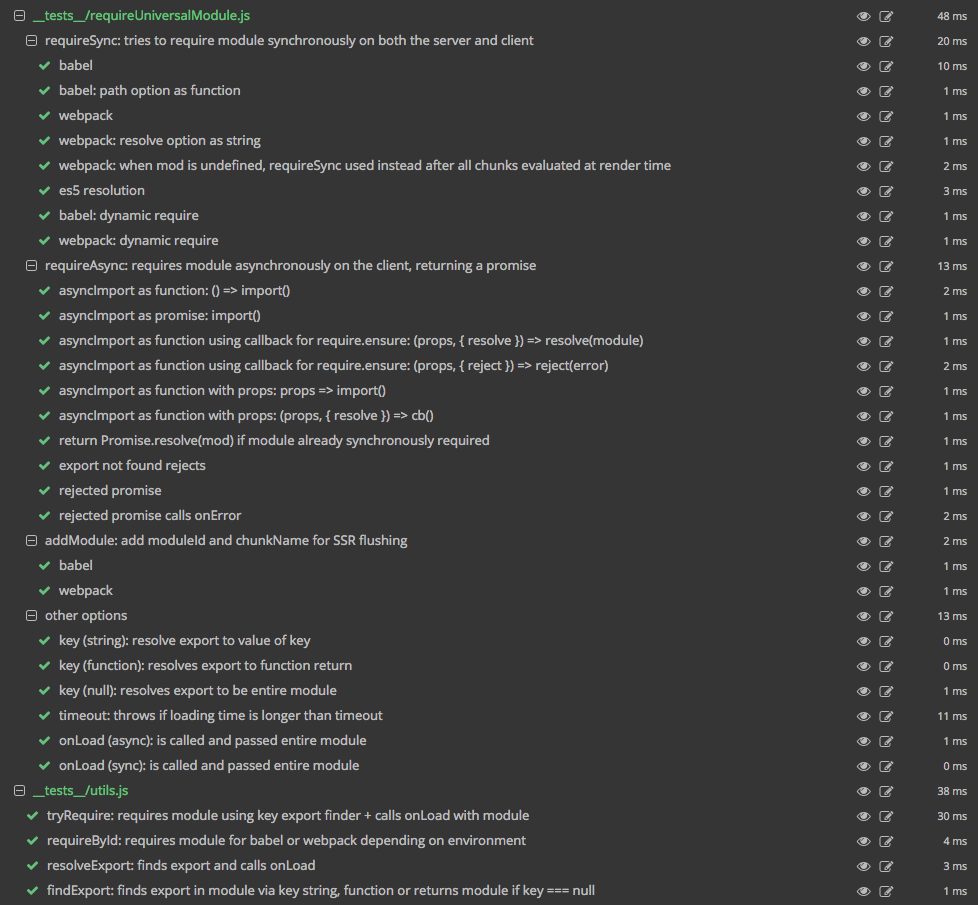

[](https://codesandbox.io/s/github/faceyspacey/redux-first-router-codesandbox/tree/master/?module=r1oVP5YEUZ)

🍾🍾🍾 **[GIT CLONE LOCAL DEMO](https://github.com/faceyspacey/universal-demo)** 🚀🚀🚀

# React Universal Component [](https://gitter.im/Reactlandia/Lobby)

<p align="center">
  <a href="https://www.npmjs.com/package/react-universal-component">
    
  </a>

  <a href="https://travis-ci.org/faceyspacey/react-universal-component">
    
  </a>

  <a href="https://lima.codeclimate.com/github/faceyspacey/react-universal-component/coverage">
    
  </a>

  <a href="https://greenkeeper.io">
    
  </a>

  <a href="https://lima.codeclimate.com/github/faceyspacey/react-universal-component">
    
  </a>

  <a href="https://www.npmjs.com/package/react-universal-component">
    
  </a>

  <a href="https://www.npmjs.com/package/react-universal-component">
    
  </a>
</p>


For "power users" the SPA is dead. If you're not universally rendering on the server you're doing it "wrong." You're losing money for you, your clients, your employers. All hail the Google god.

*This is the final universal component for React you'll ever need, and it looks like this:*

```js
import universal from 'react-universal-component'

const UniversalComponent = universal(props => import(`./${props.page}`))

export default () =>
  <div>
    <UniversalComponent page='Foo' />
  </div>
```

It's made possible by our [PR to webpack](https://github.com/webpack/webpack/pull/5235) which built support for ```require.resolveWeak(`'./${page}`)```. Before it couldn't be dynamic--i.e. it supported one module, not a folder of modules. 

You no longer need to create a hash of all your universal or loadable components. You can frictionlessly support multiple components in one HoC as if imports weren't static. This seamingly small thing--we predict--will lead to universal rendering finally becoming commonplace. It's what a universal component for React is supposed to be.

Of course, you also need [webpack-flush-chunks](https://github.com/faceyspacey/webpack-flush-chunks) to bring this together server-side. Ultimately that's the real foundation here and the most challenging part. Packages in the past like *React Loadable* did not address this aspect. They excelled at the SPA. In terms of universal rendering, they got you maybe 15% of the way by providing the module IDs rendered. There's a lot more than that.

In the future both packages will be distilled into one product called `universal-render`--or ***"Universal"*** for short. The transition will be seamless. We're making this space as easy as possible for "power users" like yourself that prefer the *frameworkless* approach over the constraints of a framework like Next.js.

> DEFINITION: "Universal Rendering" is *simutlaneous* SSR + Splitting, not trading one for the other.

## I didn't know Universal Rendering was such a pain...
That's probably because you were trapped in SPA land. If you didn't know how much of a pain in the ass *universal rendering* has been, check this quote from the React Router docs:



> If you were already in the know, you're probably one of our first users, and we thank you for your support and feeling the essence of our mission. Thank god this is over!


## Installation

```yarn add react-universal-component```

*.babelrc:*
```js
{
  "plugins": ["universal-import"]
}
```

> For Typescript or environments without Babel, just copy what [babel-plugin-universal-import](https://github.com/faceyspacey/babel-plugin-universal-import) does.

## Motivation

To learn why this has been so complicated, read our launch article (June 8th):

**[Code Cracked for Code-Splitting + SSR in Reactlandia](https://medium.com/@faceyspacey/code-cracked-for-code-splitting-ssr-in-reactlandia-react-loadable-webpack-flush-chunks-and-1a6b0112a8b8)**


## Other Packages You Will Need/Want

To be clear, you can get started with just the simple `HoC` shown at the top of the page, but to accomplish universal rendering, you will need to follow the directions in the *webpack-flush-chunks* package:

- **[webpack-flush-chunks](https://github.com/faceyspacey/webpack-flush-chunks)**

And if you want CSS chunks *(which we highly recommend)*, you will need:
- [extract-css-chunks-webpack-plugin](https://github.com/faceyspacey/extract-css-chunks-webpack-plugin)


## API + Options


```js
universal(asyncComponent, options)
```

**asyncComponent:**
- ```props => import(`./${page}`)```
- `import('./Foo')` *// doesn't need to be wrapped in a function when using the babel plugin!*
- `(props, cb) => require.ensure([], require => cb(null, require('./Foo')))`

The first argument can be a function that returns a promise, a promise itself, or a function that takes a node-style callback. The most powerful and popular is a function that takes props as an argument.

**Options (all are optional):**

- `loading`: LoadingComponent, -- *default: a simple one is provided for you*
- `error`: ErrorComponent, -- *default: a simple one is provided for you*
- `key`: `'foo'` || `module => module.foo` -- *default: `default` export in ES6 and `module.exports` in ES5* 
- `timeout`: `15000` -- *default*
- `onLoad`: `module => doSomething(module)
- `onError`: `error => handleError(error)
- `minDelay`: `0` -- *default*


**In Depth:**
> All components can be classes/functions or elements (e.g: `Loading` or `<Loading />`)

- `loading` is the component class or function corresponding to your stateless component that displays while the primary import is loading. While testing out this package, you can leave it out as a simple default one is used.

- `error` similarly is the component that displays if there are any errors that occur during your aynschronous import. While testing out this package, you can leave it out as a simple default one is used.

- `key` lets you specify the export from the module you want to be your component if it's not `default` in ES6 or `module.exports` in ES5. It can be a string corresponding to the export key, or a function that's passed the entire module and returns the export that will become the component.

- `timeout` allows you to specify a maximum amount of time before the `error` component is displayed. The default is 15 seconds.

- `onLoad` is a callback function that receives the *entire* module. It allows you to export and put to use things other than your `default` component export, like reducers, sagas, etc. E.g: `onLoad: module => store.replaceReducer({ ...otherReducers, foo: module.fooReducer })`.

- `onError` is a callback called if async imports fail. It does not apply to sync requires.

- `minDelay` is essentially the minimum amount of time the loading component will always show for. It's good for enforcing silky smooth animations, such as during a 500ms sliding transition. It insures the re-render won't happen until the animation is complete. It's often a good idea to set this to something like 300ms even if you don't have a transition, just so the loading spinner shows for an appropriate amount of time without jank.


## Flushing for SSR

Below is the most important thing on this page. It's a quick example of the connection between this package and [webpack-flush-chunks](https://github.com/faceyspacey/webpack-flush-chunks):

```js
import { flushChunkNames } from 'react-universal-component/server'
import flushChunks from 'webpack-flush-chunks'
import ReactDOM from 'react-dom/server'

export default function serverRender(req, res) => {
  const app = ReactDOM.renderToString(<App />)

  const { js, styles, cssHash } = flushChunks(webpackStats, { 
    chunkNames: flushChunkNames()
  })

  res.send(`
    <!doctype html>
    <html>
      <head>
        ${styles}
      </head>
      <body>
        <div id="root">${app}</div>
        ${cssHash}
        ${js}
      </body>
    </html>
  `)
```


## Preload

You can preload the async component if there's a likelihood it will show soon:

```js
import universal from 'react-universal-component'

const UniversalComponent = universal(import('./Foo'))

export default class MyComponent extends React.Component {
  componentWillMount() {
    UniversalComponent.preload()
  }

  render() {
    return <div>{this.props.visible && <UniversalComponent />}</div>
  }
}
```


## Props API

You can pass `isLoading` and `error` props to the resulting component returned from the `universal` HoC. This has the convenient benefit of allowing you to continue to show the ***same*** `loading` component (or trigger the ***same*** `error` component) that is shown while your async component loads *AND* while any data-fetching may be occuring in a parent HoC. That means less jank from unnecessary re-renders, and less work (DRY).

Here's an example using Apollo:

```js
const UniversalUser = universal(import('./User'))

const User = ({ loading, error, user }) =>
  <div>
    <UniversalUser isLoading={loading} error={error} user={user} />
  </div>

export default graphql(gql`
  query CurrentUser {
    user {
      id
      name
    }
  }
`, {
  props: ({ ownProps, data: { loading, error, user } }) => ({
    loading,
    error,
    user,
  }),
})(User)
```
> If it's not clear, the ***same*** `loading` component will show while both async aspects load, without flinching/re-rendering. And perhaps more importantly **they will be run in parallel**.


## Contributing

We use [commitizen](https://github.com/commitizen/cz-cli), so run `npm run cm` to make commits. A command-line form will appear, requiring you answer a few questions to automatically produce a nicely formatted commit. Releases, semantic version numbers, tags, changelogs and publishing to NPM will automatically be handled based on these commits thanks to [semantic-release](https://github.com/semantic-release/semantic-release). Be good.


## Tests

Reviewing a module's tests are a great way to get familiar with it. It's direct insight into the capabilities of the given module (if the tests are thorough). What's even better is a screenshot of the tests neatly organized and grouped (you know the whole "a picture says a thousand words" thing). 

Below is a screenshot of this module's tests running in [Wallaby](https://wallabyjs.com) *("An Integrated Continuous Testing Tool for JavaScript")* which everyone in the React community should be using. It's fantastic and has taken my entire workflow to the next level. It re-runs your tests on every change along with comprehensive logging, bi-directional linking to your IDE, in-line code coverage indicators, **and even snapshot comparisons + updates for Jest!** I requestsed that feature by the way :). It's basically a substitute for live-coding that inspires you to test along your journey.




## More from FaceySpacey in Reactlandia
- [redux-first-router](https://github.com/faceyspacey/redux-first-router). It's made to work perfectly with *Universal*. Together they comprise our *"frameworkless"* Redux-based approach to what Next.js does (splitting, SSR, prefetching, routing).
